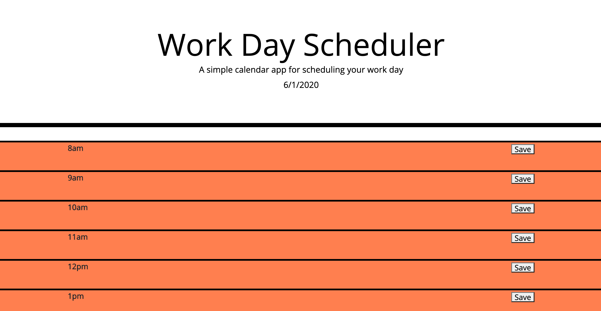

# day_planner

This is a planner to effectively manage the time of a busy professional.  Today's date will be displayed on the top of the page.  Below there are time blocks for the work hours of 8am to 5pm.  These time blicks are color-coded as present, past, and future.  Past blocks will be red, the present block will be yellow, and future blocks will green.  If you click on a timeblock, a text block will appear that can be editted.  There is a save button to keep the text on the page when it is refreshed.

Published Website: https://grantgarrison7.github.io/day_planner/

